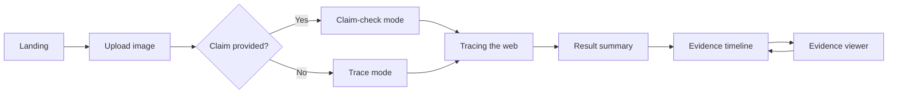
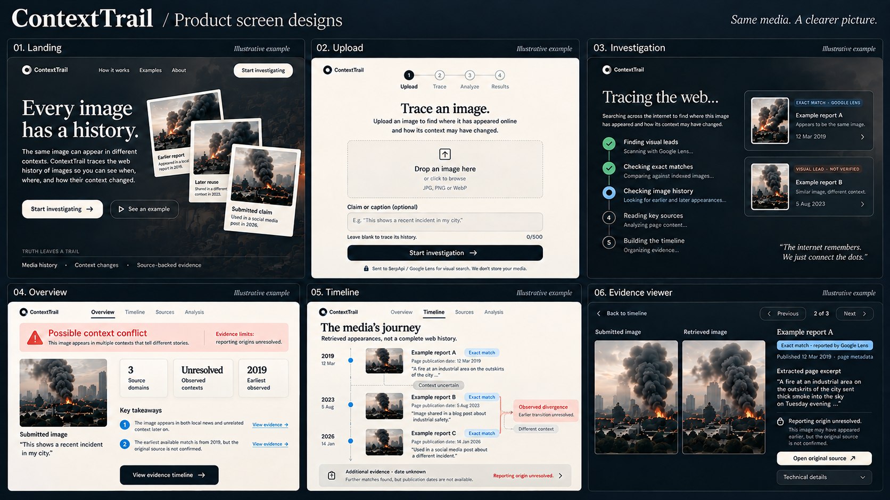
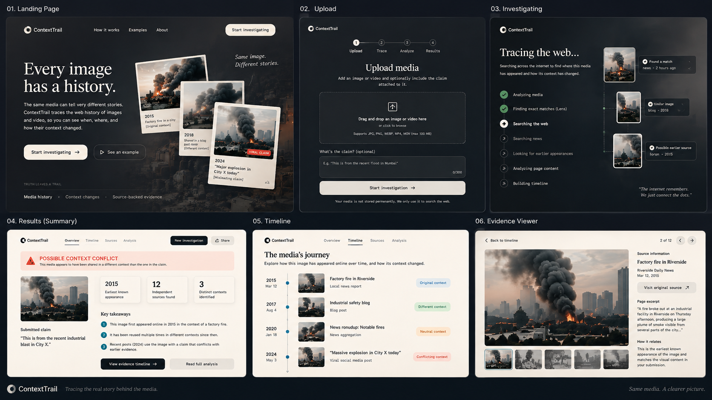
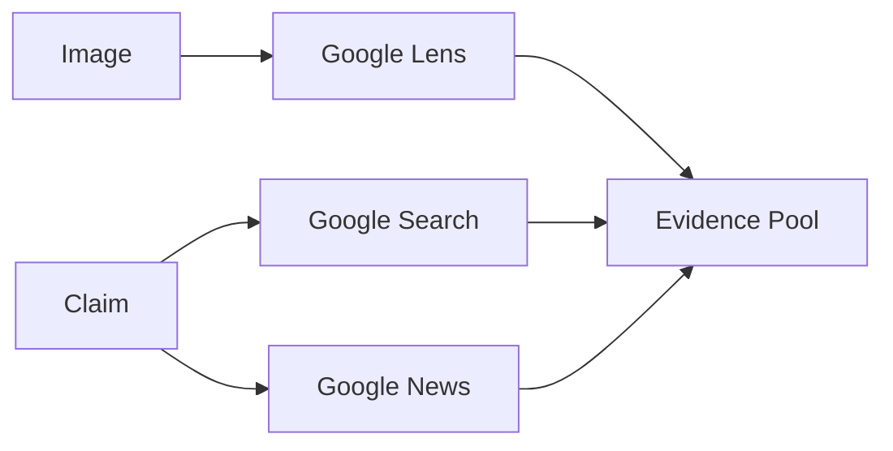
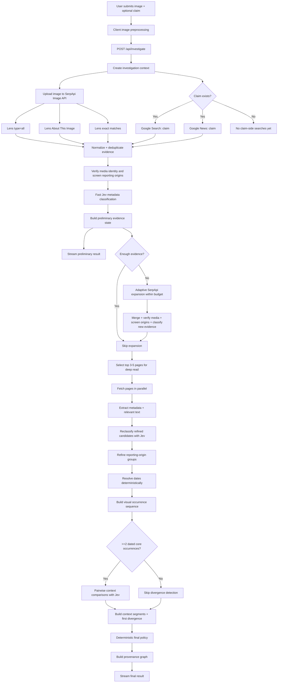
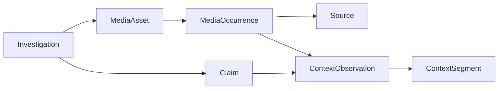
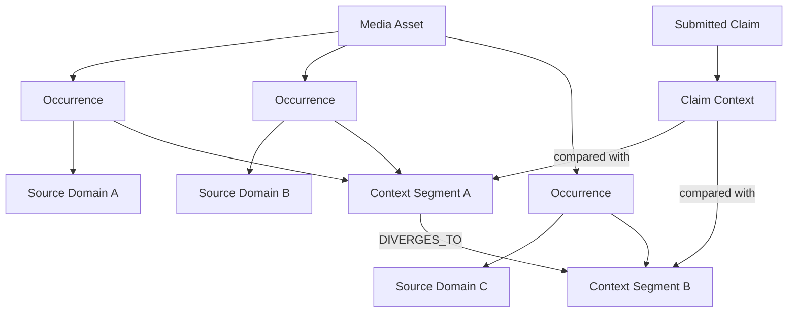
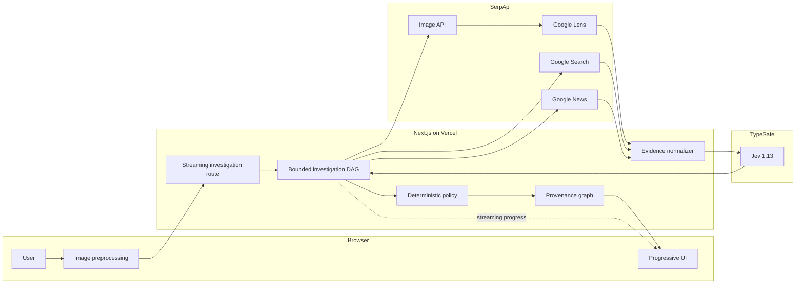

# ContextTrail — Master Product, UX & Architecture Specification

**Version:** 1.1  
**Status:** Decision-frozen for hackathon implementation  
**Target:** SerpApi India Hackathon 2026 — Knowledge & Public Interest  
**Primary deployment:** Vercel  
**Primary language/runtime:** TypeScript / Next.js  
**Core external systems:** SerpApi + TypeSafe Jev  
**Hackathon v1 scope:** Image-first. Video is explicitly deferred from the judged critical path.  
**Document purpose:** Single source of truth for v1 product intent, UX behavior, architecture, data contracts, search budgets, evidence semantics, policy, limits, testing, failure handling, privacy, demo behavior, and definition of done.

---

# 0. How to use this document

This document is deliberately opinionated.

If an implementation detail is already defined here, do not invent a competing product or architecture decision.

If a genuinely missing implementation detail must be chosen, use the smallest reversible choice that preserves every invariant in this specification.

The decision hierarchy is:

1. Product intent
2. User experience
3. Evidence semantics
4. Execution DAG
5. Data contracts
6. Implementation details

If a lower-level implementation choice conflicts with a higher-level rule, the higher-level rule wins.

The core invariant is:

```text
SerpApi discovers live web evidence.
Jev classifies bounded semantic relationships in retrieved evidence.
Deterministic TypeScript handles exact logic, budgets, dates, chronology, identity and final policy.
ContextTrail presents an inspectable provenance trail.
```

The product must never silently replace missing evidence with model-generated claims.

The product must never present invented metrics, invented publishers, invented partnerships, fabricated source counts, fabricated dates, or fabricated accuracy claims as real.

---

# 1. Product

## 1.1 One-line definition

> **ContextTrail reconstructs the web history of an image and shows when, where, and how its context changed.**

A user uploads an image.

They may optionally provide the claim or caption attached to it.

ContextTrail searches the live web for exact or visually related appearances, reconstructs a chronological evidence trail, identifies context shifts, and—when a claim is provided—compares the retrieved evidence against that claim.

---

## 1.2 The product insight

A large class of misleading media is not fabricated.

It is real media reused with a different context:

```text
same image
different year

same image
different city

same photograph
different event

old image
new breaking-news caption

real image
misattributed story
```

Existing reverse-image tools are useful for finding visually related pages, but the user still has to manually:

```text
search the image
open many results
compare dates
compare locations
separate copies from merely similar images
separate current reporting from historical reporting
work out when the context changed
decide which evidence actually matters
```

ContextTrail turns that manual investigation into a structured provenance workflow.

---

## 1.3 The differentiation

ContextTrail is not valuable merely because it can call Google Lens.

The product must add a layer that Lens alone does not provide as the primary artifact:

```text
retrieved occurrences
→ normalized evidence
→ source-domain counting and reporting-origin checks
→ chronology
→ context segmentation
→ first observed context divergence
→ claim comparison
→ inspectable provenance timeline
```

The primary output is not a grid of reverse-image matches.

The primary output is:

> **A reconstructed evidence history showing how the same media moved through different contexts over time.**

The product must feel like a provenance investigation, not a Lens wrapper.

---

## 1.4 What ContextTrail is

ContextTrail is:

- a visual provenance tool;
- an image-history search experience;
- a context-drift detector;
- a news-literacy tool;
- an evidence browser;
- a live-search product where SerpApi is indispensable;
- an interface for tracing how one piece of media acquires different meanings over time.

---

## 1.5 What ContextTrail is not

ContextTrail is not:

```text
a generic AI chatbot
a fake-news detector
an AI-image detector
a truth oracle
a misinformation probability meter
a source-credibility ranking service
an autonomous research agent
a generic web-search wrapper
a Google Lens clone
```

It must never output claims such as:

```text
92% fake
81% true
this person lied
this source is malicious
this is definitely the original upload
```

It reports observed evidence relationships.

---

## 1.6 Hackathon v1 scope

The judged v1 is intentionally image-first.

Supported input:

```text
JPG
JPEG
PNG
WebP
```

The following are not part of the judged critical path:

```text
video upload
video keyframe extraction
video-specific search
long-form video provenance
audio analysis
social-post URL ingestion
browser extension
persistent accounts
shareable investigation links
```

Video remains a valid future extension, but it must not destabilize the image investigation flow before submission.

The v1 success condition is:

> **One image investigation must be excellent, reliable, fast, inspectable, and visually distinctive.**

---

## 1.7 Product modes

There are exactly two v1 modes.

### A. Trace mode

Input:

```text
image only
```

Question:

> Where has this image appeared, and how has its context changed over time?

Output:

```text
media history
earliest observed occurrence
source-domain count
timeline
context shifts
evidence viewer
```

There is no truth/conflict verdict because there is no claim to compare against.

Primary headline:

> **Media history reconstructed**

When evidence is weak:

> **Limited media history found**

---

### B. Claim-check mode

Input:

```text
image
+
claim / caption
```

Question:

> Does the retrieved web history of this image conflict with the context asserted by the supplied claim?

Output:

```text
all Trace-mode output
+
claim comparison
+
current-event context
+
one conservative evidence status
```

Statuses:

```text
CONTEXT_CONFLICT
POSSIBLE_CONTEXT_CONFLICT
NO_CONFLICT_FOUND
INSUFFICIENT_EVIDENCE
```

---

## 1.8 Hackathon fit

Primary track:

> **Knowledge & Public Interest**

Primary fit:

> **News literacy**

SerpApi must be materially responsible for the application's usefulness.

SerpApi is therefore the live evidence-discovery layer, not a cosmetic API call.

The judged demo must use live SerpApi responses.

Fixtures are allowed for automated tests, development, and deterministic local verification, but must never be presented as live retrieval during the judged demo.

---

## 1.9 Hackathon constraints

Current public hackathon material lists:

- one to five participants;
- public GitHub repository;
- demo video under three minutes;
- meaningful SerpApi usage;
- judging based on idea strength, originality, technical complexity, usefulness, and meaningful SerpApi usage;
- 250 SerpApi search credits per month for building/testing.

The current official Rules, Terms, and current homepage content list the submission deadline as:

> **October 10, 2026 at 23:59 IST**

Internal project target:

```text
October 5, 2026
```

as code/content freeze, leaving a buffer for demo capture, repository cleanup, submission validation, and unexpected external-service failures.

---

# 2. Product principles

These are non-negotiable.

## 2.1 Evidence before explanation

Every major conclusion must point to inspectable evidence.

No generated paragraph may substitute for missing evidence.

---

## 2.2 Search first, model second

Direction:

```text
live search
→ retrieved evidence
→ bounded semantic classification
→ deterministic policy
```

Never:

```text
model hypothesis
→ search for supporting links
```

---

## 2.3 Provenance before verdict

The product's strongest artifact is the media history.

The verdict is secondary.

The user should still receive substantial value in Trace mode with no claim at all.

---

## 2.4 Uncertainty is a valid result

When evidence is weak:

```text
INSUFFICIENT_EVIDENCE
```

is a successful product outcome.

Never lower thresholds merely to produce a more dramatic demo.

---

## 2.5 No false precision

Model probabilities may appear in advanced technical details.

They must never be converted into:

- probability a claim is true;
- probability a claim is false;
- misinformation score;
- source trust score.

---

## 2.6 "Earliest observed" is not "original"

ContextTrail only knows what the current investigation retrieved.

Use:

> **Earliest observed occurrence**

Never use:

> Original upload

or:

> First time this appeared online

unless an external source explicitly establishes that fact.

---

## 2.7 One dominant task per screen

No dense all-in-one dashboard.

The experience is:

```text
Landing
→ Upload
→ Investigation
→ Result summary
→ Evidence timeline
→ Evidence viewer
```

Each screen gets one dominant job.

---

## 2.8 No fake product proof

The interface must not contain fictional SaaS proof such as:

```text
1.2B+ sources analyzed
95% match rate
Trusted by major newsrooms
Millions of investigations completed
```

unless it becomes literally true and independently supportable.

Do not use fake customer logos or testimonials.

Do not invent real publisher names for illustrative examples.

If a mock/sample example is fictional, label it clearly:

> **Illustrative example**

and use generic source labels.

---

## 2.9 Product truth over marketing language

Prefer concrete capability language:

```text
Trace earlier appearances
Follow the timeline
Compare contexts
Inspect the evidence
```

Avoid generic phrases such as:

```text
AI-powered truth engine
Instant misinformation detection
The ultimate fact checker
```

The product may use AI internally, but AI is not the landing-page value proposition.

---

## 2.10 The hero must explain the product visually

A generic beautiful photograph is insufficient.

The landing hero must visually communicate:

> **Same image. Different contexts. Different stories.**

The same image should visibly appear in multiple contextual frames/cards, for example:

```text
earlier report
later reuse
current disputed claim
```

If the example is not a real sourced investigation, label it illustrative.

---

# 3. User experience

## 3.1 Experience overview



---

## 3.2 Screen 1 — Landing

### Purpose

Create immediate understanding and interest.

The user should understand within seconds that:

> media has a searchable history, and ContextTrail reconstructs it.

### Primary copy

Headline:

> **Every image has a history.**

Supporting copy:

> ContextTrail traces where an image has appeared across the web, reconstructs how its context changed, and shows you the evidence trail.

Primary CTA:

> **Start investigating**

Secondary CTA:

> **See an example**

### Visual concept

The landing screen is serious, editorial, and restrained.

Preferred direction:

```text
dark editorial / newsroom investigation
large serif headline
high-contrast typography
one dominant provenance visual
minimal navigation
no dashboard chrome
```

The hero visual uses the same image repeated across a small number of contextual cards.

Example visual logic:

```text
2019
Earlier report

2023
Reused in another context

2026
Current disputed claim
```

The point is not the example story itself.

The point is visually demonstrating:

> one image can carry multiple contexts over time.

### Product-truth strip

If a lower capability row is shown, it uses only truthful capabilities:

```text
Trace earlier appearances
Follow the timeline
Compare contexts
Inspect the evidence
```

No vanity metrics.

### Navigation

Recommended:

```text
How it works
Example
About
Start investigating
```

No navigation item should exist merely to make the page look established.

---

## 3.3 Screen 2 — Upload

### Purpose

Collect only what an investigation needs.

Controls:

```text
image upload
optional claim textarea
start investigation
```

No image/video tabs in v1.

### Claim field

The claim is optional.

Placeholder:

> e.g. “This is Delhi flooding yesterday”

Helper:

> Optional — leave blank to trace the image without checking a claim.

### Upload privacy note

Visible near the submission action:

> Your image is used for visual search and is not persisted by ContextTrail.

A more explicit privacy explanation may be linked nearby.

---

## 3.4 Image preprocessing

The user does not manually satisfy SerpApi's upload limit.

Client processing:

```text
decode image
preserve aspect ratio
resize if required
encode WebP
reduce quality iteratively
target <= 450 KB
```

Maximum long edge:

```text
1600 px
```

Preferred starting WebP quality:

```text
0.82
```

Reduce quality in steps until encoded size is <= 450 KB.

Minimum quality:

```text
0.55
```

Fallback:

```text
JPEG
```

The UI may briefly display:

> Preparing image…

Do not expose compression controls.

---

## 3.5 Screen 3 — Investigation

This is a showcase screen.

### Purpose

Make latency informative.

The user must never stare at a generic spinner.

Headline:

> **Tracing the web…**

Supporting copy:

> Searching live web evidence to find where this image has appeared and how its context has changed.

### Stage list

Possible stages:

```text
✓ Preparing image
● Finding visual leads with Google Lens
○ Checking exact matches
○ Checking image history
○ Searching the web
○ Searching current news
○ Classifying evidence
○ Reading key sources
○ Building provenance timeline
```

Completed stages can show real counts:

```text
✓ Google Lens — 18 matches
✓ Google Search — 9 results
✓ News — 6 current reports
```

Only display counts actually returned in this investigation.

Never display fake percentages.

Never estimate “72% complete” unless there is a real deterministically defined progress measure. v1 should not display such percentages.

### Progressive evidence

As soon as useful evidence arrives, surface it.

Examples:

```text
8 visual matches found

Earliest dated candidate
Mar 12, 2019

3 source domains found
```

These must be actual current-investigation values.

The user should perceive:

> The system is investigating.

not:

> The system is loading.

---

## 3.6 Latency targets

Targets, not guarantees:

```text
first streamed stage event       < 1 s
first search evidence             < 4 s
first provenance clue             < 7 s
preliminary summary               < 12 s
final investigation               < 25 s ideal
hard application cutoff           55 s
```

The server must finalize using available evidence before the cutoff.

---

## 3.7 Screen 4 — Result summary

Purpose:

> Show the strongest conclusion and the minimum evidence needed to understand it.

Do not put the full timeline here.

### Claim-check headlines

#### CONTEXT_CONFLICT

> **Context conflict found**

Supporting text:

> Matching occurrences from multiple source domains, with separately evidenced reporting origins, associate this image with a different context than the submitted claim.

Optional second sentence when chronology supports it:

> Matching occurrences also predate the claimed event.

#### POSSIBLE_CONTEXT_CONFLICT

> **Possible context conflict**

Supporting text:

> Matching evidence associates this image with a different context, but corroboration is limited or its reporting origins are unresolved.

#### NO_CONFLICT_FOUND

> **No conflict found in retrieved evidence**

Supporting text:

> The retrieved visual evidence did not reveal a strong contradiction to the submitted claim.

Mandatory note:

> **This does not prove the claim is true.**

#### INSUFFICIENT_EVIDENCE

> **Insufficient evidence**

Supporting text:

> The live search did not return enough qualifying visual evidence and corroboration for a reliable context comparison.

### Trace-mode headline

> **Media history reconstructed**

No truth/conflict status appears.

---

## 3.8 Result summary metrics

Show at most three primary metrics:

```text
Source domains
Observed contexts
Earliest observed occurrence
```

Example only:

```text
24
source domains

3
observed contexts

Mar 12, 2019
earliest observed occurrence
```

“Observed contexts” is based on high-confidence comparisons within the retrieved sample, as defined in Section 20.2.
If comparisons are unresolved, show “Unresolved” instead of an exact count.

“Source domains” counts distinct registrable domains containing core visual occurrences.
It is not a count of independently reported stories.
Supporting web/news domains are counted separately in Analysis.

Below the headline, show a compact “Evidence limits” sentence covering material conditions such as unresolved reporting origins, unknown dates, unverified visual leads, unavailable retrieval stages, or limited comparison coverage.
Link each takeaway and conclusion to the evidence IDs that support it.
Do not hide these limitations in the technical drawer.

Do not call the earliest date an original publication.

---

## 3.9 Key takeaways

Maximum three.

Generated from deterministic templates.

Examples:

```text
Strong visual matches predate the claimed event.

Matching media is associated with a different location in retrieved evidence.

Current reporting about the claimed event was found, but this visual was not among the matching media evidence.
```

Do not let a general-purpose model freely write the takeaways.

---

## 3.10 Primary result action

Primary CTA:

> **View evidence timeline**

Secondary actions may include:

```text
View sources
Technical details
Start new investigation
```

The timeline is the next primary experience.

---

## 3.11 Screen 5 — Evidence timeline

Purpose:

> Show the history, not merely the verdict.

This is the primary product artifact.

Example conceptual timeline:

```text
2019 — earlier observed report
2021 — historical reuse
2023 — different contextual framing
2026 — submitted claim
```

Every occurrence displays:

```text
date and date precision
publication-date source
thumbnail
title
domain
media relationship and match basis
context label
one short retrieved excerpt or “No excerpt available”
reporting-origin status when relevant
```

Media relationship badges:

```text
Exact match
Near match
Visual lead
```

Context badges:

```text
Same context
Different context
Historical reference
Unclear
Submitted claim
```

Only `Exact match` and qualifying `Near match` items count as core provenance occurrences.

`Visual lead` items are supporting evidence and are visually de-emphasized.

---

## 3.12 Timeline chronology

A node may enter the dated timeline only when it has a usable date.

Unknown-date evidence appears below the timeline under:

> **Additional evidence · date unknown**

Never guess timeline positions.
Unknown-date cards remain accessible and display why the date is unknown or disputed.
Publication dates describe source pages, not the moment an image was captured or necessarily first added to a page.

Display a persistent timeline caption:

> This timeline shows appearances found in this investigation. Gaps do not mean the image was absent from the web.

Connect retrieved observations without implying uninterrupted coverage.
Use a labeled “Context uncertain” connector for uncertain or failed comparisons, and “Not compared” for unperformed comparisons.
If more than eight dated core occurrences exist, retain all retrieved dated occurrences in the timeline but identify the subset used for context analysis.
Uncompared edges must not inherit context labels.

---

## 3.13 First observed context divergence

When evidence supports it, mark:

> **First observed context divergence in retrieved evidence**

Never use:

> First lie

or:

> When misinformation started

The product does not infer intent.
The marker identifies the later occurrence of the earliest strongly different compared pair, and links to both endpoints.
It does not date the real-world start of a context change.
If earlier comparisons are missing or uncertain, add “Earlier transitions are unresolved”; never imply this was the first change on the internet.

---

## 3.14 Screen 6 — Evidence viewer

This is an immersive evidence-inspection screen or modal.

Clicking any timeline occurrence opens it.

Layout:

```text
large media / retrieved image

source title
domain
date
source role

relevant source excerpt

media relationship
location relationship
context relationship

[Open original source]
```

Always-visible evidence details include the match basis, publication-date source and precision, relevant retrieved excerpt, and known reporting-origin relationship.
Show the submitted and retrieved images side by side, or with an accessible comparison toggle.
“Exact match” includes the attribution “Reported by Google Lens”; a near match names the local verification method.
If the retrieved image or page could not be loaded, show that limitation instead of substituting the submitted image as source evidence.
Label SERP snippets as search snippets and page excerpts as extracted page text.
Never invent an excerpt or silently paraphrase one as a quote.

Advanced technical details are collapsible.

Possible details:

```text
SerpApi engine
SerpApi result position
Lens result type
Jev probabilities
retrieval timestamp
canonical URL
publication-date source
```

Raw IDs and probability distributions are optional; match basis, date provenance, excerpts, and material limitations are always visible.

Judges can inspect them.

---

## 3.15 Navigation model

Result navigation:

```text
Overview
Timeline
Sources
Analysis
```

These are views over one in-memory investigation.

There is no persistent dashboard in v1.

---

# 4. Design system

## 4.1 Visual direction

The visual direction is:

> **cinematic editorial investigation / modern newsroom artifact**

Not:

```text
generic SaaS admin panel
cyberpunk command center
glassmorphism showcase
AI dashboard
analytics dashboard
```

The design bar comes from:

```text
typography
composition
restraint
evidence imagery
transitions
hierarchy
```

not from filling the screen with widgets.

---

## 4.2 Information-density principle

Default composition target:

```text
majority breathing room
one dominant content object
limited secondary UI
decoration only when it reinforces provenance
```

A screen should feel intentionally incomplete rather than visually crowded.

---

## 4.3 Typography

Headlines:

```text
Instrument Serif
```

UI/body:

```text
Geist Sans
```

Include robust system fallbacks.

---

## 4.4 Core palette

```text
Warm paper           #F6F4EF
Ink                  #101418
Deep investigation   #0E151B
Cobalt signal        #4C7DFF
Conflict coral       #E45C52
Evidence green       #3E8B66
Muted border         #D8DAD7
```

---

## 4.5 Theme behavior

Purposeful transitions:

```text
Landing              dark editorial
Upload               light editorial
Investigation        dark immersive
Result / Timeline    light evidence report
Evidence Viewer      dark immersive
```

This is intentional storytelling, not inconsistent theming.

---

## 4.6 UI rules

- generous whitespace;
- one dominant purpose per screen;
- no dense dashboard;
- no fake charts;
- no gratuitous gradients;
- no invented scale metrics;
- no fake trust logos;
- no decorative data;
- motion is subtle and purposeful;
- all status states include icon + text, never color alone;
- provenance evidence is visually stronger than model/AI branding.

---

## 4.7 Motion

Use Motion / Framer Motion.

Allowed:

```text
hero context cards separating slightly
search-result cards appearing as evidence arrives
timeline nodes revealing sequentially
source viewer cross-fade
subtle stage transitions
```

Not allowed:

```text
constant glowing animation
fake scanning lasers
random particles
motion implying retrieval that did not happen
```

Respect:

```text
prefers-reduced-motion
```

---

## 4.8 Visual references and screen designs

The following designs are part of this PRD.
They describe the intended experience, not an implemented application or a verified investigation.
All sample imagery, dates, excerpts, counts, and sources in the boards are illustrative.
Production screens must use current-investigation evidence and the policies in this document.

### Updated screen board



Use this board for composition, typography, theme transitions, and the placement of evidence details.
The written screen requirements below and the evidence policies govern behavior and exact copy if any small text in the generated board differs.
Do not implement a generated label or number merely because it appears in the image.

### Original visual reference



Retain its restrained editorial character, repeated-image hero, serif headlines, and clear progression from investigation to evidence.
The original reference's video support, Share action, “original context” labels, independent-source counts, and fictional publisher assertions are superseded by the requirements below.
The upload screen uses warm paper and the evidence viewer uses the dark investigation theme, as specified in Section 4.5.

### Shared layout and interaction rules

- Desktop reference viewport: 1440 × 900, with a centered content width up to 1280 px and generous outer margins.
- Use an 8 px spacing rhythm, 16–24 px between related controls, and 40–64 px between major content groups.
- Prefer 16 px body text, 14 px supporting labels, 44–64 px screen headlines, and a 72–96 px desktop landing headline.
- Use Instrument Serif for editorial headings and Geist Sans for controls, metadata, and evidence text.
- Use 10–14 px corner radii for controls and restrained surfaces, thin borders, and minimal shadows.
- Use one primary action per view; secondary links must remain visibly secondary.
- Keep primary controls at least 44 px tall, with visible keyboard focus and adequate text contrast.
- Pair every status color with explicit text and an icon; blue denotes navigation or evidence identity, not truth.
- Reserve coral for an evidence-supported conflict status; unresolved evidence uses neutral styling.
- Keep source identity, match basis, date source, and excerpt attribution legible without opening technical details.
- At narrow widths, stack content in reading order, use 20 px side margins, and reduce headlines without truncation.
- Respect reduced motion; no motion may imply evidence retrieval or a completed stage that has not occurred.

### Screen 1: Landing

**Purpose:** Explain image reuse before asking for an upload.

Use a dark editorial canvas with a two-column hero.
The left column contains the headline “Every image has a history.”, one short supporting paragraph, and the primary “Start investigating” action.
The secondary “See an example” action opens a clearly labeled illustrative walkthrough or a real sourced example when available.
An illustrative walkthrough must not run a simulated live investigation or imply API calls were made.

The right column shows the same photograph in three staggered paper cards labeled “Earlier report”, “Later reuse”, and “Submitted claim”.
Place “Illustrative example” beside the entire composition, not only inside a hover tooltip.
Use sample years only as illustrative context; never label a card “Original upload”.
Keep the background subdued so the headline and repeated-image idea dominate.

Navigation contains only useful destinations: How it works, Example, About, and Start investigating.
Use the existing truthful capability strip beneath the hero instead of statistics or publisher logos.
On mobile, place the hero copy and actions first, then the cards in a readable non-overlapping arrangement.

### Screen 2: Upload

**Purpose:** Collect an image and an optional claim with minimal friction.

Use a warm-paper page with a compact header, Back action, and centered form approximately 560 px wide.
Headline: “Trace an image.”
The form contains a keyboard-accessible image dropzone, an image preview after selection, an optional claim field, and one primary “Start investigation” button.
The dropzone names JPG, JPEG, PNG, and WebP only.
Do not show video controls or the original reference's unsupported 100 MB upload promise.

After selection, show a contained thumbnail, file name, Replace, and Remove controls.
Label the textarea “Claim or caption (optional)”.
Helper text: “Leave blank to trace the image's history.”
Do not add a separate mode switch; the presence of a claim determines the investigation mode.

Immediately above or below the submission action, show:

> Your image is sent to SerpApi / Google Lens for visual search. ContextTrail does not persist your image.

Before a valid image is selected, the primary action is disabled with an understandable explanation.
During preprocessing, display “Preparing image…” and prevent duplicate submission.
For unsupported or undecodable input, show an inline error with a replacement action while preserving the claim.
Do not introduce a required account or ask users to paste API keys into this screen.

### Screen 3: Investigation

**Purpose:** Show actual work and arriving evidence without implying a result prematurely.

Use a dark immersive layout with “Tracing the web…” and a stage list on the left, progressive evidence on the right.
The desktop layout is approximately 40% stage information and 60% arriving evidence.
On mobile, use the current stage followed by evidence cards, with the full stage list available below.

Give visual discovery and exact-match retrieval separate stages: “Finding visual leads” and “Checking exact matches”.
Follow with image history, web/news context when applicable, classification, reading key sources, and building the timeline.
Concurrent stages may be active together; the layout must not imply a mandatory serial sequence.
Use distinct Waiting, Running, Completed, Unavailable, and Skipped states.
Only show counts obtained from actual responses and never show a percentage-complete meter.

Each arriving card contains the source title/domain, thumbnail if available, and a clear relationship label.
Use “Exact match · reported by Google Lens” or “Visual lead · not verified” as appropriate.
Preliminary evidence is marked preliminary and may change after page reading or classification.
Do not place unknown dates into a decorative chronological trail while the investigation is running.

Provide Cancel investigation, which stops new work and aborts outstanding requests where possible.
Explain that requests already sent may still consume provider credits.
On recoverable failures, keep available evidence visible and identify the unavailable stage.
On fatal visual-search failure, offer Return to upload with the selected image and claim retained only in browser memory.

### Screen 4: Result overview

**Purpose:** Present the conclusion together with the evidence needed to assess it.

Use warm paper with compact result navigation: Overview, Timeline, Sources, Analysis.
The header contains New investigation; omit Share because persistent sharing is outside v1.
On desktop, place the submitted image and claim in the left third and the result in the remaining space.
On mobile, place the result headline before the submitted-image block.

Use the exact status copy from Section 3.7.
Trace mode displays a media-history headline and no claim verdict or conflict alert.
Below the headline, show a readable “Evidence limits” sentence reflecting actual limitations.
For NO_CONFLICT_FOUND, keep “This does not prove the claim is true.” visible directly below the supporting text.

Show no more than three metrics: Source domains, Observed contexts, and Earliest observed occurrence.
Use “Unresolved” for an undetermined context count and “Date unknown” when no usable earliest date exists.
Do not render missing values as zero or imply that source-domain count measures independent reporting.

Show at most three deterministic takeaways, each with a View evidence control linked to the supporting occurrence or comparison.
Use “View evidence timeline” as the primary action.
Keep Analysis secondary so the result remains an evidence summary rather than a telemetry dashboard.

### Screen 5: Evidence timeline

**Purpose:** Make the retrieved history and its gaps inspectable.

Use a warm-paper reading surface with the heading “The media's journey”.
Directly beneath it, display the retrieved-sample limitation from Section 3.12.
Use a single vertical timeline with a narrow date column and spacious occurrence rows.
Each row contains the date and precision, thumbnail, source title/domain, match basis, context label, publication-date source, and a short attributed excerpt.
Opening a row leads to the evidence viewer and preserves the timeline position for Back navigation.

Use solid connections only for assessed relationships, with explicit context labels.
Use a dashed connection labeled “Context uncertain” for ambiguous/failed comparisons, or “Not compared” for omitted comparisons.
Do not imply that blank spans represent an absence of appearances on the web.
Mark the first established divergence with both comparison endpoints and the qualifier “in retrieved evidence”.
Show “Earlier transitions are unresolved” whenever applicable.

Display shared reporting origins or unresolved origins on affected cards without hiding duplicated occurrences.
Place unknown-date and disputed-date material in a separate “Additional evidence · date unknown” section with the reason visible.
Keep supporting visual leads distinct from core dated occurrences.
An unverified visual lead must not become a node in the core provenance sequence merely because its page has a date.
Display dated supporting leads in a separate supporting-evidence group with their date and “Not part of the core timeline” label.

On mobile, place date information above each card and keep a single readable vertical flow.
Do not require horizontal dragging, zooming, or hover to inspect evidence.

### Screen 6: Evidence viewer

**Purpose:** Let a user inspect the actual evidence behind an occurrence or comparison.

Use the dark immersive theme with Back to timeline and Previous/Next controls at the top.
The main area uses approximately two-thirds of the width for image inspection and one-third for source details.
Within the image area, show Submitted image and Retrieved image side by side with visible labels.
Use contain sizing so the comparison does not hide crops or differing image boundaries.
On narrow screens, use an accessible labeled toggle and then place source details below the image.

The source panel shows title, domain, publication date and source, match basis, reporting-origin status, and a clearly attributed source excerpt.
Use “Search snippet” when only SerpApi text is available; use “Extracted page excerpt” only after successful page reading.
If no text is available, state “No excerpt available”.
If the source image cannot be loaded, state “Retrieved image unavailable” without substituting the uploaded image as source evidence.

Use Open original source as the primary action with an external-link indicator.
Keep raw search IDs, retrieval metadata, verifier measurements, and Jev probability distributions in Technical details.
Do not hide material identity or date uncertainty inside that disclosure.

If implemented as a modal, trap focus, support Escape, and restore focus to the originating timeline card on close.
Previous/Next controls need accessible names, and the current position must reflect real evidence count.
When opened from a divergence or takeaway, show the linked evidence relationship and allow both supporting occurrences to be inspected.

### Sources and Analysis views

These remain secondary views of the same investigation, not additional dashboards.
Sources uses a readable evidence list with domain, URL, match basis, reporting-origin group, and source-opening actions.
Distinguish core visual occurrences, visual leads, and contextual web/news results.
Analysis shows actual retrieval stages, request counts, missing stages, reporting-origin checks, comparison coverage, and the deterministic reasons for the final status.
No synthetic accuracy percentages, source credibility scores, or hidden model reasoning appear.

### Required design states and acceptance checks

| Area | Required states or checks |
| --- | --- |
| Upload | Empty, selected, preparing, unsupported file, decode failure, keyboard selection, replacement/removal |
| Investigation | Concurrent stages, streamed evidence, preliminary labels, partial failure, canceled, fatal failure, cutoff with partial evidence |
| Overview | All four claim statuses, Trace mode, no usable dates, unresolved context count, visible limits, evidence-linked takeaways |
| Timeline | Known dates, imprecise dates, unknown/disputed dates, shared reporting origins, uncertain/uncompared edges, sampled comparisons |
| Viewer | Submitted/retrieved comparison, missing image, unavailable excerpt, search snippet versus page text, source link, keyboard return |
| Layout | Desktop and mobile reading order, visible focus, AA contrast, reduced motion, long titles and claims, no horizontal overflow |

The board is a composition reference; these states must be designed and verified in the eventual implementation even when they are not pictured.
Visual inspection must check that no sample names, counts, dates, or excerpts from the board leak into live investigation results.

### Design asset provenance

The original board was supplied by the user.
The updated board was generated with the built-in image-generation tool using the original as a visual reference.
Its generation brief is saved alongside the images as `contexttrail-designs/design-prompt.txt`.
The images are design assets only and are never evidence fixtures or live search results.

---


# 5. Technical architecture

## 5.1 Frozen v1 stack

```text
Next.js App Router
React
TypeScript
Tailwind CSS
Motion / Framer Motion
Radix primitives where accessibility behavior is useful
Vercel Node.js Functions
SerpApi
TypeSafe Jev
```

Do not introduce into the v1 critical path:

```text
FastAPI
Django
Flask
Supabase
Firebase
Postgres
Redis
Celery
Kafka
GPU hosting
Docker-only runtime requirements
Exa as a production retrieval dependency
Firecrawl as a production crawling dependency
another reverse-image provider
```

unless this document is explicitly revised.

Direct page fetch + Readability remains the refinement path.

---

## 5.2 Deployment

Deploy on Vercel.

Use the Node runtime.

Investigation route:

```ts
export const runtime = "nodejs";
export const maxDuration = 60;
```

The product must still be designed to complete inside 60 seconds.

---

## 5.3 Vercel payload invariant

Vercel Functions enforce request/response body limits.

Therefore:

```text
raw high-resolution images never reach Vercel
```

Client-preprocessed image request target:

```text
< 1 MB
```

Actual SerpApi-uploaded image:

```text
<= 500 KB
```

Client target:

```text
<= 450 KB
```

to preserve margin.

---

## 5.4 No database in v1

There is no server-side database.

Investigation state exists:

```text
in the streamed server execution
+
in browser memory
+
optionally sessionStorage after completion
```

Persist only the latest completed investigation JSON in `sessionStorage`.

Do not persist user images.

A refresh may lose an active investigation.

Acceptable for v1.

---

## 5.5 Secrets

Server-only variables:

```text
SERPAPI_API_KEY
TYPESAFE_API_KEY
TYPESAFE_MODEL=jev-1.13.0
```

Never expose them through `NEXT_PUBLIC_*`.

Never log them.

---

# 6. SerpApi architecture

## 6.1 SerpApi is the sensory layer



SerpApi discovers evidence.

Jev does not replace retrieval.

---

## 6.2 SerpApi Image API

Before Lens, the server uploads the compressed image to the SerpApi Image API.

Supported types:

```text
JPEG
PNG
WebP
```

Maximum upstream file size:

```text
500 KB
```

Returned `image_id` expires after approximately:

```text
10 minutes
```

Never persist it.

---

## 6.3 Google Lens usage

Use `engine=google_lens` with the uploaded `image_id`.
Reserve three Lens searches in both modes:

```text
type=all                 discovery, visual matches, related_content
type=exact_matches       explicit exact-occurrence retrieval
type=about_this_image    historical/contextual enrichment
```

Run the dedicated exact-match request at most once per investigation, even when `all` returns exact-match entries.
This is a deliberate v1 budget choice to avoid depending on an optional `all` response surface.
Merge and deduplicate exact occurrences from both responses while preserving retrieval provenance.
These calls may start concurrently after upload, within the global search concurrency limit.

A visual result's `exact_matches: true` flag or `serpapi_exact_matches_link` is a discovery signal, not an exact occurrence by itself.
Build requests with the controlled SerpApi client; do not blindly fetch returned API links.
Only validated occurrence entries from an `exact_matches` result collection qualify for `EXACT_MATCH`.
Missing, malformed, and empty collections must be distinguishable from request failure.

Validate the adapter against current official documentation, recorded response fixtures, and a gated live case before claiming integration readiness.
Do not assume every image returns exact occurrences.

Lens `q` refinement applies only to a supported search type and consumes an adaptive slot.
Do not attach `q` to `exact_matches` or `about_this_image` requests.

## 6.4 Lens semantics

```text
exact_matches occurrence collection
    provider-reported exact occurrences; preserve engine/type/search ID

visual_matches
    discovery candidates; promotion requires Section 10 verification

visual-result exact_matches flag/link
    navigation signal only; never an identity assertion for that page

about_this_image
    contextual/history evidence; not automatic proof of image identity

related_content
    bounded query candidates; not evidence of media occurrence
```

Do not flatten these surfaces into a single confidence class.
Provider-reported identity and locally verified similarity must remain distinguishable in the UI.

---

## 6.5 Google Search

Use SerpApi Google Search for:

```text
claim context
historical-event search
source corroboration
targeted expansion
trace-mode expansion from Lens related_content
```

Claim-check initial query:

```text
user claim verbatim
```

Do not let an LLM rewrite the first query.

---

## 6.6 Google News

Use SerpApi Google News only when a claim is provided.

Purpose:

> Understand current reporting around the claimed event/context.

News does not by itself prove media provenance.

---

## 6.7 No alternate search provider in v1

Do not replace the live provenance path with Exa, Firecrawl search, another SERP service, or another reverse-image system to save credits.

Reason:

```text
SerpApi is intentionally central to the product
+
meaningful SerpApi usage is part of hackathon evaluation
```

Credit pressure is handled through:

```text
fixtures
normal SerpApi caching
bounded request budgets
early stopping
selective live integration testing
```

---

## 6.8 Caching

Do not set:

```text
no_cache=true
```

in normal operation.

Allow normal SerpApi cache behavior.

---

# 7. Search budgets

Search budgets are hard application invariants.

No implementation may silently add extra search calls outside these limits.

## 7.1 Image + claim

Hard maximum: **6 SerpApi search requests**.

```text
1 Lens type=all
1 Lens type=exact_matches
1 Lens type=about_this_image
1 Google Search claim
1 Google News claim
-------------------------
5 base searches
1 optional adaptive search
6 maximum
```

## 7.2 Image without claim

Hard maximum: **4 SerpApi search requests**.

```text
1 Lens type=all
1 Lens type=exact_matches
1 Lens type=about_this_image
1 optional Google Search using the best related-content query
-------------------------
3 base searches
1 optional adaptive search
4 maximum
```

The trace-mode Google Search is the adaptive slot, not a base call plus another expansion.
Skip it when evidence is already sufficient or no grounded query is available.
Every attempted search, including failures and retries, consumes the application budget before dispatch.
Do not retry reserved Lens searches automatically or repurpose a failed base slot.
The image upload is separately bounded to one attempt and is not a search request.
Reserve base-call capacity before permitting expansion.

---

## 7.3 Development credit discipline

The free development allowance is limited.

Normal automated tests and normal CI must not call live external search APIs.

Use fixtures for:

```text
unit tests
integration tests
most E2E tests
UI verification
failure-state verification
policy regression tests
```

Live search runs are reserved for:

```text
SerpApi integration work
milestone verification
demo-case rehearsal
pre-submission verification
judged demo
```

---

# 8. Adaptive search policy

The search graph is adaptive but bounded.

Models do not autonomously invent search loops.

Expansion priority:

```text
1. Lens refined visual search using q=claim
2. Google Search using strongest Lens related_content.query
3. Google Search using quoted title + domain of strongest historical anchor
```

Use no more expansion slots than the current mode allows.
The priority list above applies to Claim-check mode and selects at most one search.
Trace mode uses only the optional related-content Google Search defined in Section 7.2.

---

## 8.1 Early stop

Do not spend remaining search budget simply because it exists.

Stop expansion when deterministic policy already has enough evidence for:

```text
CONTEXT_CONFLICT
```

or:

```text
NO_CONFLICT_FOUND
```

and the relevant candidates satisfy the cross-domain, separately evidenced reporting-origin rule in Section 13.
Different hostnames alone do not satisfy this rule.
Preliminary policy and early stopping use the same conservative checks as final policy.
Trace mode has no claim status: skip its optional search when at least two relevant core occurrences from two source domains have usable dates and classified context evidence.
This trace stopping rule concerns useful retrieved coverage and does not assert independent reporting.

---

## 8.2 Expansion trigger

Expand when:

```text
final state would currently be INSUFFICIENT_EVIDENCE
OR
conflict corroboration is limited to one reporting group or origins are unresolved
OR
visual evidence exists but context evidence is weak
```

These claim-policy triggers apply to Claim-check mode.
In Trace mode, expand only when the trace stopping condition is unmet and a grounded related-content query is available.

---

# 9. Investigation DAG

This DAG is the central execution contract.



---

## 9.1 Execution characteristics

Independent retrieval nodes start concurrently.

Do not execute:

```text
Lens → wait → Search → wait → News → wait
```

Instead, once inputs exist:

```text
Lens
Search
News
```

fan out concurrently within limits.

The UI consumes results while later work continues.

---

## 9.2 Stage boundaries

```text
CLIENT_PREPROCESS
INITIAL_RETRIEVAL
NORMALIZE
VERIFY_MEDIA
SCREEN_REPORTING_ORIGINS
FAST_CLASSIFY
PRELIMINARY
EXPAND_IF_NEEDED
DEEP_READ
REFINED_CLASSIFY
REFINE_REPORTING_ORIGINS
CHRONOLOGY
DIVERGENCE
FINAL_POLICY
COMPLETE
```

---

# 10. Evidence model

## 10.1 Core entities



---

## 10.2 Media relationships

Every visual candidate has one of:

```text
EXACT_MATCH
NEAR_MATCH
VISUAL_LEAD
```

### EXACT_MATCH

Source:

```text
Google Lens exact_matches
```

Provider-reported evidence that the same media appears at the retrieved URL.
The label attributes identity to Google Lens; it is not a guarantee of origin, capture date, or source independence.

### NEAR_MATCH

A visual result whose retrieved image passes the stronger local identity-verification gate in Section 10.3.
A hash-distance threshold alone never qualifies it.

### VISUAL_LEAD

A Lens visual match without enough local evidence to call it the same media.

`VISUAL_LEAD` may guide investigation.

It does not independently establish provenance.

---

## 10.3 Near-match screening and verification

Perceptual hashing is a cheap screening step, not proof of image identity.
For at most eight retrieved images, use a three-second fetch timeout, one MB response limit, bounded decoding, and the source-page destination restrictions.
Use `sharp` to compute a 64-bit difference hash.
Hamming distance <= 8 makes an image eligible for further verification only.

Promotion to `NEAR_MATCH` requires an additional deterministic spatial comparison of the decoded images that checks corresponding scene detail across multiple regions.
A second global hash or a text-only Jev judgment is not sufficient.
The verifier must reject low-detail images, ambiguous repeated patterns, inadequate overlap, and spatially inconsistent correspondence.
Preserve the method/version, configuration ID, measured comparison values, and result.

Before enabling this promotion, select and pin the comparison algorithm and acceptance thresholds using labeled fixtures covering resizing, compression, crops, overlays, and hard negatives such as different smoke, flood, and building photographs.
Validate against held-out fixtures and at least one live retrieved-image case.
Record the evaluated cases and observed errors; do not invent accuracy claims or tune to one demo image.
No default threshold is implied by this PRD for the stronger verifier.
Until the verifier passes its acceptance gate, near-match promotion remains disabled and exact matches carry the core provenance path.

```text
hash pass + stronger verifier pass -> NEAR_MATCH
hash pass only                    -> VISUAL_LEAD
comparison fails/is ambiguous     -> VISUAL_LEAD
fetch/decode/comparison unavailable -> VISUAL_LEAD
```

Only `EXACT_MATCH` and verified `NEAR_MATCH` candidates may influence core provenance, divergence, or conflict policy.
Verification must fit the existing 55-second deadline; skip work when insufficient time remains.
Failure is non-fatal and its limitation is visible.

---

# 11. Raw evidence contract

```ts
type RetrievalKind =
  | "lens_exact"
  | "lens_visual"
  | "lens_about_image"
  | "google_search"
  | "google_news";

interface EvidenceCandidate {
  id: string;

  retrievalKind: RetrievalKind;

  sourceUrl: string;
  canonicalUrl: string;
  domain: string;
  registrableDomain: string;

  title: string | null;
  snippet: string | null;

  serpPosition: number | null;
  serpSearchId: string | null;

  publishedAt: string | null;
  publishedAtSource:
    | "page_json_ld"
    | "page_meta"
    | "page_time"
    | "serpapi"
    | null;

  thumbnailUrl: string | null;
  resultImageUrl: string | null;

  mediaRelationship:
    | "EXACT_MATCH"
    | "NEAR_MATCH"
    | "VISUAL_LEAD"
    | null;

  identityEvidence: {
    basis: "lens_exact_collection" | "local_spatial_verification" | "unverified";
    hashDistance: number | null;
    verifierVersion: string | null;
    verifierConfigId: string | null;
    verificationStatus: "provider_reported" | "passed" | "failed" | "ambiguous" | "unavailable";
    comparisonMetrics: Record<string, number> | null;
  };

  reportingOrigin: {
    groupId: string;
    status: "separate_origin_evidenced" | "shared_origin" | "unresolved";
    basis: string[]; // bounded reason codes, not generated explanations
    evidenceIds: string[];
  };

  datePrecision: "day" | "month" | "year" | "unknown";
  dateStatus: "usable" | "disputed" | "unknown";
  excerptSource: "page_text" | "serp_snippet" | null;
  retrievals: Array<{
    kind: RetrievalKind;
    searchId: string | null;
    resultType: string;
    retrievedAt: string;
  }>;

  pageText: string | null;

  judgment: EvidenceJudgment | null;
}
```

Identity invariants:

- `EXACT_MATCH` requires `lens_exact_collection` and `provider_reported`, with a validated retrieval record.
- `NEAR_MATCH` requires `local_spatial_verification`, `passed`, and the pinned verifier/configuration IDs and comparison metrics.
- Hash-only or unavailable checks remain `VISUAL_LEAD` with `unverified` basis.

Retain disputed date candidates and the reason for rejection for the evidence viewer.
Never turn a month-only or year-only source date into an asserted publication day.

---

# 12. Canonical URL normalization

Perform:

```text
lowercase hostname
remove default ports
remove www.
remove fragment
remove known tracking parameters
sort remaining query parameters
remove trailing slash when safe
```

Known removable parameters:

```text
utm_*
fbclid
gclid
igshid
ref_src
mc_cid
mc_eid
```

Do not blindly remove generic:

```text
ref
```

because it may be semantically meaningful.

---

# 13. Source domains and reporting origins

`sourceDomainCount` counts distinct `registrableDomain` values among core visual occurrences.
Use a Public Suffix List-aware parser; `news.bbc.co.uk` and `www.bbc.co.uk` are one domain family.
Multiple Reddit URLs are also one source domain.
Never label this metric “Independent sources”.

Separate source-domain counting from corroboration.
Different domains may syndicate, quote, translate, or copy the same report.
Retain those occurrences in the timeline, but do not count their shared reporting origin repeatedly for a verdict.

After URL deduplication, screen metadata and then refine the strongest candidates using the existing maximum five deep-read pages.
Group shared origins using explicit syndication/original-source attribution, an identified common originating report, or substantial normalized article-text duplication.
Compare article bodies after boilerplate removal; matching titles, topics, or short quotes alone are insufficient.
Pin any text-similarity thresholds with positive and negative fixtures before using them for grouping.
Preserve supporting attribution/excerpts and the grouping reason.

Candidates with missing or ambiguous origin information remain `unresolved`.
The absence of a detected copy is not evidence of independent reporting.
`separate_origin_evidenced` requires retrieved, inspectable attribution or source material establishing a separate reporting origin relative to the corroborating group.
Jev probabilities or domain differences alone cannot set it.
If this cannot be established within the page/time budget, preserve the uncertainty rather than spending extra requests.

For strong corroboration, require at least two qualifying candidates from distinct registrable domains and distinct reporting groups with separately evidenced origins.
This is a conservative operational rule, not a guarantee of publisher independence.
Same-domain occurrences can add chronology, but cannot supply cross-domain corroboration.
Shared-origin copies count as one group; unresolved origins cannot satisfy the stronger corroboration gate.
`reportingGroupCount` counts resolved origin groups among core occurrences.
`unresolvedOriginCount` counts remaining core candidates; it does not imply that each has a unique reporting origin.

The UI uses “Source domains”, “Shared reporting origin”, and “Reporting origin unresolved”.
Analysis shows domain counts, reporting groups, unresolved candidates, and why evidence did or did not qualify.

---

# 14. Candidate retention

Before Jev classification retain:

```text
Lens exact matches        top 8
Lens visual matches       top 8
About This Image links    top 5
Google Search             top 5
Google News               top 5
```

After URL deduplication:

```text
MAX_JEV_CANDIDATES = 24
```

Selection preference:

```text
exact visual evidence
dated evidence
distinct source domains and reporting origins
earlier SERP rank
```

---

# 15. Jev architecture

## 15.1 Provider

Production provider:

```text
TypeSafe Jev
```

Pinned model:

```text
jev-1.13.0
```

Do not use a moving production alias.

---

## 15.2 Responsibility boundary

Jev may decide:

```text
semantic relevance
same/different context
page role
claim relationship
location relationship
pairwise context similarity
```

Jev may not decide:

```text
which date is earlier
time differences
counts
URL equality
domain identity
hash similarity
search budgets
final product status
```

---

## 15.3 One candidate per Jev state

Do not send the entire evidence pool as one giant state.

Example:

```json
{
  "claim": "This is Delhi flooding yesterday",
  "media_relationship": "EXACT_MATCH",
  "result": {
    "title": "Historic flooding in another location",
    "snippet": "...",
    "domain": "example.com",
    "published_at": "2024-04-17",
    "retrieval_kind": "lens_exact",
    "page_excerpt": "..."
  }
}
```

This reduces context contamination.

---

## 15.4 Jev concurrency

Maximum concurrent Jev requests:

```text
8
```

Use a concurrency limiter.

---

## 15.5 EvidenceJudgment

```ts
interface EvidenceJudgment {
  relevance: number;

  contextRelation: {
    sameContext: number;
    differentContext: number;
    historicalReference: number;
    unclear: number;
  } | null;

  pageRole: {
    reporting: number;
    factCheck: number;
    socialRepost: number;
    aggregator: number;
    commentary: number;
    other: number;
  };

  claimRelation: {
    supports: number;
    contradicts: number;
    neutral: number;
    insufficient: number;
  } | null;

  locationRelation: {
    sameLocation: number;
    differentLocation: number;
    locationNotStated: number;
    unclear: number;
  } | null;

  model: "jev-1.13.0";
  schemaVersion: "contexttrail-evidence-v1";
}
```

In Trace mode:

```text
contextRelation=null for claim comparison
claimRelation=null
locationRelation=null
```

Pairwise context classification later handles context segmentation.

---

# 16. Exact Jev questions

## 16.1 Relevance — Noul

Instruction:

> Based only on the supplied evidence, is this result materially relevant to the image or event under investigation?

TRUE:

> The result contains meaningful evidence concerning the same media, the same underlying event, or directly related context.

FALSE:

> The relationship is incidental, generic, or off-topic.

---

## 16.2 Context relationship — Choice

Only in Claim-check mode.

Instruction:

> How does the context described by this result relate to the context asserted in the user's claim?

Options:

```text
SAME_CONTEXT
The result appears to describe the same underlying event or situation asserted by the claim.

DIFFERENT_CONTEXT
The result associates the media with a different event, place, time, or situation.

HISTORICAL_REFERENCE
The result discusses the same or related media historically or retrospectively rather than presenting it as the claimed current event.

UNCLEAR
The evidence does not contain enough information to determine the relationship.
```

---

## 16.3 Page role — Choice

Instruction:

> What role does this page appear to play based only on the supplied evidence?

Options:

```text
REPORTING
FACT_CHECK
SOCIAL_REPOST
AGGREGATOR
COMMENTARY
OTHER
```

---

## 16.4 Claim relationship — Choice

Only in Claim-check mode.

Instruction:

> Based only on the supplied evidence, how does this source relate to the user's claim about what the media depicts?

Options:

```text
SUPPORTS
CONTRADICTS
NEUTRAL
INSUFFICIENT
```

This is not a global truth judgment.

---

## 16.5 Location relationship — Choice

Only when the claim explicitly contains a usable location.

Instruction:

> Based only on explicit location information in the claim and evidence, how do the locations relate?

Options:

```text
SAME_LOCATION
DIFFERENT_LOCATION
LOCATION_NOT_STATED
UNCLEAR
```

Do not infer an unstated location.

---

# 17. Semantic thresholds

Frozen for v1:

```text
RELEVANCE_THRESHOLD = 0.70
STRONG_RELATION_THRESHOLD = 0.75
```

A label is strong only when probability is >= 0.75.

Probabilities below threshold remain uncertain.

Do not tune thresholds solely to improve a demonstration case.

---

# 18. Page deep-reading

SERP metadata is the fast path.

Full-page reading is the refinement path.

Maximum pages fetched:

```text
5
```

Selection order:

```text
1. earliest dated EXACT_MATCH / NEAR_MATCH
2. strongest conflict candidate from another domain whose reporting origin needs checking
3. strongest same-context/support candidate
4. strongest fact-check candidate
5. strongest current-reporting candidate
```

Skip duplicates.

---

## 18.1 Safe page fetch

Requirements:

```text
http/https only
reject localhost
reject obvious private IP hosts
timeout 5 seconds
maximum response body 2 MB
content-type must be text/html
maximum 3 redirects
```

Failure is non-fatal.

---

## 18.2 Readable extraction

Use:

```text
@mozilla/readability
+
jsdom
```

Extract:

```text
page title
main text
JSON-LD metadata
OpenGraph metadata
published-date candidates
```

No external crawler is required in v1.

---

## 18.3 Relevant excerpt construction

Do not send a giant article to Jev.

Create an excerpt up to:

```text
8,000 characters
```

Composition:

```text
title
SERP snippet
first two useful paragraphs
highest-overlap paragraphs with claim/title/query tokens
```

Stop-word filtering and token overlap are deterministic.

No generative summarizer.

---

# 19. Date handling

Dates belong to deterministic code.

## 19.1 Claim date

Use:

```text
chrono-node
```

Reference:

```text
investigation start timestamp
+
browser timezone
```

Examples:

```text
today
yesterday
last Friday
Sep 21
September 2026
```

If one usable date is found:

```text
claimDate = parsed date
```

If none:

```text
claimDate = null
```

If materially ambiguous:

```text
claimDate = null
```

Do not guess.

---

## 19.2 Evidence date precedence

Highest-confidence source wins:

```text
1. JSON-LD datePublished
2. article:published_time / equivalent metadata
3. explicit <time datetime>
4. SerpApi date
5. unknown
```

If sources materially disagree:

```text
publishedAt = null
```

unless one source is clearly the page's structured publication field.

---

## 19.3 Temporal conflict

A candidate is:

```text
PREDATES_CLAIM
```

only when:

```text
claimDate != null
candidate.publishedAt != null
candidate.publishedAt < claimDate - 24 hours
```

The 24-hour buffer reduces timezone ambiguity.

---

# 20. Pairwise context divergence

This is the flagship analytical feature.

Use at most:

```text
8 dated core media occurrences
```

Core occurrence means:

```text
EXACT_MATCH
or
NEAR_MATCH
```

Sort chronologically.

Compare each adjacent pair in the selected sequence.
Select up to eight deterministically: include the earliest and latest dated core occurrences, then prefer distinct source domains/reporting groups, with chronological position and candidate ID as stable tie-breakers.
Keep all remaining dated evidence visible but mark its context comparison as not performed.
Dates too imprecise to establish order cannot create an ordered divergence edge.

---

## 20.1 Pairwise Jev question

State:

```text
Occurrence A metadata/text
Occurrence B metadata/text
```

Question:

> Do these two occurrences present the media as belonging to the same underlying event or context?

Options:

```text
SAME_CONTEXT
DIFFERENT_CONTEXT
UNCLEAR
```

Use strong threshold:

```text
0.75
```

---

## 20.2 Context segmentation and gaps

```text
first selected occurrence -> start a local segment
SAME_CONTEXT >= .75       -> connect within that segment
DIFFERENT_CONTEXT >= .75  -> start the next segment; record both endpoints
otherwise                -> uncertain connector; do not infer continuity
comparison not performed -> unexamined connector; do not infer continuity
```

An uncertain connector breaks asserted continuity; a later clear comparison cannot retroactively resolve it.
Segments are contiguous observed runs, not proof of globally distinct events.
If a context reappears later, do not claim it is a new unique event merely because it starts a new segment.

Expose `contextSegmentCount` only when the displayed dated core sequence has complete, decisive adjacent comparisons.
Otherwise return null and show “Unresolved”.
The metric “Observed contexts” must be explained as observed context segments in the retrieved sequence, not a count of all distinct real-world stories.

Mark the earliest strong DIFFERENT_CONTEXT edge in the compared sequence as:

> **First observed context divergence in retrieved evidence**

Store the two occurrence IDs, their observed dates, and whether earlier transitions are unresolved.
Associate the marker with the later occurrence, not a guessed change time.
If no strong difference is found, say “No divergence established in the compared evidence”, not “The context never changed”.
Always expose selected/eligible occurrence counts and comparison failures or omissions in Analysis.

---

# 21. Final status policy

There is no weighted truth score.

No model directly selects the final status.

Final policy is deterministic.

---

## 21.1 Qualifying conflict evidence

A candidate qualifies as strong conflict evidence when all are true:

```text
relevance >= 0.70

mediaRelationship is EXACT_MATCH or NEAR_MATCH

AND

(
  contextRelation.differentContext >= 0.75
  OR
  claimRelation.contradicts >= 0.75
  OR
  locationRelation.differentLocation >= 0.75
)
```

---

## 21.2 CONTEXT_CONFLICT

Return when:

```text
>= 2 qualifying conflict candidates
AND
>= 2 distinct registrable domains
AND
>= 2 separately evidenced reporting-origin groups (Section 13)
```

At least one must be:

```text
EXACT_MATCH
```

unless two `NEAR_MATCH` candidates have passed the stronger identity gate and satisfy the same cross-domain/reporting-origin corroboration rule.

---

## 21.3 POSSIBLE_CONTEXT_CONFLICT

Return when:

```text
exactly 1 strong qualifying conflict candidate
```

or:

```text
multiple conflict signals exist
but cross-domain/reporting-origin corroboration is insufficient or unresolved
```

---

## 21.4 NO_CONFLICT_FOUND

Return only when all are true:

```text
>= 3 relevant core visual occurrences
>= 2 distinct source domains
>= 2 separately evidenced reporting-origin groups (Section 13)
0 qualifying conflict candidates
>= 1 strong SAME_CONTEXT or SUPPORTS judgment
```

UI must include:

> **This does not prove the claim is true.**

---

## 21.5 INSUFFICIENT_EVIDENCE

Return in all other Claim-check cases.

When uncertain, prefer this state.

---

# 22. Trace-mode result policy

Trace mode never returns claim statuses.

```ts
interface TraceResult {
  mode: "trace";
  earliestObservedOccurrence: string | null;
  sourceDomainCount: number;
  reportingGroupCount: number;
  unresolvedOriginCount: number;
  contextSegmentCount: number | null;
  firstObservedContextDivergence: {
    fromOccurrenceId: string;
    toOccurrenceId: string;
    observedAt: string;
    earlierTransitionsUnresolved: boolean;
  } | null;
  comparisonCoverage: { eligible: number; selected: number; comparedPairs: number };
  limitations: string[]; // deterministic, evidence-backed reason codes
  undatedEvidence: TimelineItem[];
  timeline: TimelineItem[];
}
```

Headline:

> **Media history reconstructed**

If evidence is weak:

> **Limited media history found**

---

# 23. Provenance graph

Internal graph:



This graph is the source of the timeline and result summary.

The user does not see a generic force-directed graph in v1.

---

# 24. Streaming API contract

Critical endpoint:

```text
POST /api/investigate
```

Request:

```text
multipart/form-data
```

Fields:

```text
claim        optional string
timezone     IANA timezone
locale       browser locale
media        processed image
```

---

## 24.1 Response

Use streamed:

```text
application/x-ndjson
```

Do not use WebSockets.

Do not require EventSource because the request is POST with media.

Client uses `fetch()` and reads the response stream.

---

## 24.2 Stream events

```ts
type InvestigationEvent =
  | { type: "investigation.started"; investigationId: string }
  | { type: "stage.started"; stage: Stage }
  | { type: "stage.completed"; stage: Stage; detail?: string }
  | { type: "search.batch"; engine: string; count: number }
  | { type: "evidence.discovered"; evidence: PublicEvidenceCandidate }
  | { type: "evidence.classified"; id: string; publicJudgment: PublicJudgment }
  | { type: "provenance.partial"; timeline: TimelineItem[] }
  | { type: "verdict.preliminary"; verdict: ClaimStatus }
  | { type: "divergence.detected"; divergence: Divergence }
  | { type: "investigation.completed"; result: InvestigationResult }
  | { type: "investigation.error"; code: string; message: string };
```

---

# 25. Suggested project structure

```text
src/
├── app/
│   ├── page.tsx
│   ├── investigate/
│   │   └── page.tsx
│   └── api/
│       └── investigate/
│           └── route.ts
│
├── components/
│   ├── landing/
│   ├── input/
│   ├── investigation/
│   ├── result/
│   ├── timeline/
│   └── evidence-viewer/
│
├── lib/
│   ├── media/
│   │   ├── image-preprocess.client.ts
│   │   ├── dhash.ts
│   │   └── verify-identity.ts
│   │
│   ├── serpapi/
│   │   ├── client.ts
│   │   ├── image-upload.ts
│   │   ├── lens.ts
│   │   ├── google-search.ts
│   │   └── google-news.ts
│   │
│   ├── evidence/
│   │   ├── normalize.ts
│   │   ├── dedupe.ts
│   │   ├── reporting-origins.ts
│   │   ├── candidates.ts
│   │   ├── page-fetch.ts
│   │   └── dates.ts
│   │
│   ├── jev/
│   │   ├── client.ts
│   │   ├── questions.ts
│   │   └── classify.ts
│   │
│   ├── investigation/
│   │   ├── dag.ts
│   │   ├── budget.ts
│   │   ├── expansion.ts
│   │   ├── divergence.ts
│   │   ├── policy.ts
│   │   └── graph.ts
│   │
│   └── contracts/
│       ├── investigation.ts
│       ├── evidence.ts
│       └── events.ts
│
└── styles/
```

---

# 26. Investigation runtime pseudocode

```ts
async function investigate(input, stream) {
  const ctx = createContext(input); // deadline, base reservations, attempt budget
  const evidence = createEvidencePool();
  stream.stage("INITIAL_RETRIEVAL");

  // Independent claim searches begin while upload is running.
  const claimJobs = input.claim
    ? [searchWithinBudget(ctx, "google", input.claim),
       searchWithinBudget(ctx, "google_news", input.claim)]
    : [];
  const lensJobs = uploadOnce(input.media).then(imageId =>
    settleAndStreamInto(evidence, stream, [
      lensWithinBudget(ctx, imageId, "all"),
      lensWithinBudget(ctx, imageId, "exact_matches"),
      lensWithinBudget(ctx, imageId, "about_this_image"),
    ])
  );
  await settleAndStreamInto(evidence, stream, [...claimJobs, lensJobs]);
  requireSuccessfulVisualSearch(ctx); // enrichment alone is insufficient

  normalizeAndDeduplicate(evidence);
  await verifyEligibleMediaWithinLimits(ctx, evidence);
  screenReportingOrigins(evidence);
  await classifyFast(evidence);
  stream.preliminary(buildPreliminary(ctx, evidence)); // trace emits no verdict

  if (shouldExpand(ctx, evidence)) {
    const query = chooseOneGroundedExpansion(ctx, evidence);
    if (query) {
      const added = await searchWithinBudget(ctx, query.engine, query.params);
      mergeAndDeduplicate(evidence, added);
      await verifyEligibleMediaWithinLimits(ctx, evidence); // shared total of eight
      screenReportingOrigins(evidence);
      await classifyNewCandidates(evidence);
    }
  }

  const pages = await fetchWithinLimits(ctx, chooseDeepReadCandidates(evidence, 5));
  await refineJudgments(pages);
  refineReportingOriginGroups(evidence, pages);
  resolveDatesDeterministically(evidence);
  const occurrences = buildVerifiedCoreOccurrences(evidence);
  const divergence = await compareSelectedOccurrencesWithinDeadline(ctx, occurrences, 8);
  const policy = applyDeterministicPolicy(ctx, evidence);
  const graph = buildProvenanceGraph({ evidence, occurrences, divergence, policy });
  stream.complete(buildResultWithLimitations(graph));
}
```

All helpers share the same budgets and deadline.
Settled results are merged as they arrive; failures remain explicit.
Partial and final policy share the identity and reporting-origin gates.
The final result retains unknown-date evidence and comparison gaps.

---

# 27. Concurrency

Use bounded parallelism.

Limits:

```text
SerpApi search concurrency     4
Jev concurrency                8
page-fetch concurrency         5
result-image verification fetches 4
```

Do not launch uncontrolled `Promise.all()` over arbitrary result counts.

---

# 28. Timeouts

```text
SerpApi search       12 s
SerpApi image upload  8 s
Jev                   8 s
page fetch             5 s
image fetch            3 s
local identity verification bounded by remaining application deadline
whole investigation   55 s
```

At 55 seconds:

```text
stop starting new work
finalize with available evidence
```

---

# 29. Failure policy

## Both visual-discovery and exact-match requests fail

Fatal.

UI:

> **Visual search could not be completed.**

About This Image enrichment alone does not satisfy visual-search success.
Do not substitute another reverse-image provider.

---

## Dedicated exact-match request fails or returns no occurrences

Continue with validated exact occurrences already returned by `all`, verified near matches, and clearly labeled visual leads.
Keep “No exact occurrences returned” distinct from “Exact-match retrieval unavailable”.
Never promote visual leads to compensate for the failure.
Do not silently retry or exceed the reserved request budget.
If no qualifying core occurrences remain, return limited history in Trace mode or INSUFFICIENT_EVIDENCE in Claim-check mode.

---

## Google Search fails

Continue.

Mark:

```text
webContextAvailable=false
```

---

## Google News fails

Continue.

---

## About This Image fails

Continue.

---

## Page fetch fails

Keep the SERP metadata judgment.

---

## Reporting origins or identity verification remain unresolved

Keep the evidence visible and state the limitation.
Do not count unresolved reporting origins toward the stronger corroboration gate.
Do not promote unverified visual leads.
One qualifying conflict group can support POSSIBLE_CONTEXT_CONFLICT; stronger statuses still require all their policy conditions.

---

## Jev fails for some candidates

Store:

```text
judgment=null
```

Continue.

---

## Jev unavailable for the entire investigation

Trace mode can still show retrieved media history.

Claim-check mode returns:

```text
INSUFFICIENT_EVIDENCE
```

with:

> Semantic evidence classification was unavailable.

Do not fabricate heuristic semantic judgments.

---

# 30. Source-page security

Fetched page text is untrusted.

Treat it as data.

Do not execute scripts.

Do not render raw HTML.

Sanitize displayed text.

External links:

```html
target="_blank"
rel="noopener noreferrer"
```

Reject obvious local/private destinations to reduce SSRF risk.

---

# 31. Privacy

The app must state clearly:

> Media used for visual search is sent to SerpApi / Google Lens.

Raw user images are not persisted by ContextTrail.

The temporary SerpApi `image_id` is not persisted.

Do not log media bytes.

---

# 32. Search transparency

The advanced Analysis view should make SerpApi visibly central.

Example using real current-investigation telemetry only:

```text
Google Lens via SerpApi
18 matches

Google Search via SerpApi
9 results

Google News via SerpApi
6 results

TypeSafe Jev
17 evidence items classified
```

Counts must be real.

No placeholder telemetry in production.

---

# 33. Deterministic takeaways

## Temporal conflict

Condition:

```text
core visual occurrence predates claim
```

Copy:

> Matching media was found before the date asserted in the claim.

---

## Location conflict

Condition:

```text
strong different-location judgment
+
core visual occurrence
```

Copy:

> Matching media is associated with a different location in retrieved evidence.

---

## Historical reuse

Condition:

```text
historicalReference >= .75
```

Copy:

> Retrieved sources show this media being used historically before the submitted claim.

---

## No current-media corroboration

Condition:

```text
current News results exist
+
none are core media occurrences
```

Copy:

> Current reporting about the claimed event was found, but this visual was not among the matching media evidence.

This is a weak contextual signal, not proof.

---

# 34. Technical details drawer

Show on request:

```text
search IDs
retrieval engine
source URLs
canonical URLs
result position
media relationship
publication-date source
Jev model version
Jev probability distributions
context comparison
retrieval timestamp
```

Never show hidden model reasoning.

---

# 35. Accessibility

Minimum:

```text
WCAG AA contrast
keyboard-operable evidence viewer
visible focus rings
alt text for UI imagery
status text in addition to color
reduced-motion mode
screen-reader labels for stage progress
```

---

# 36. Responsive behavior

Primary judged experience is desktop.

Must remain usable on mobile.

Desktop:

```text
max content width ~1280 px
```

Investigation and evidence viewer may use full-viewport layouts.

Mobile timeline becomes one vertical column.

No horizontal-drag dependency.

---

# 37. Browser support

Target current stable:

```text
Chrome
Edge
Safari
Firefox
```

Image preprocessing must use standard browser capabilities with graceful failure.

---

# 38. Testing

Use:

```text
Vitest
Playwright
```

Fixtures are allowed and expected for automated testing.

No live external APIs in normal CI.

Live integration suite runs only with:

```text
RUN_LIVE_TESTS=1
```

and required API keys.

---

## 38.1 Required deterministic fixtures

At minimum:

```text
claim conflict
possible conflict
no conflict found
insufficient evidence
trace mode with divergence
trace mode without dates
Jev partial failure
News failure
deep-read failure
About This Image failure
Lens fatal failure
all response has only an exact-match navigation flag/link
dedicated exact collection empty, malformed, or unavailable
hash collision between different smoke/flood/building images
resized/cropped/compressed image passes or fails stronger identity gate
syndicated copies on different domains share one reporting group
reporting origins unresolved despite different domains
uncertain comparison before a later observed divergence
more than eight dated occurrences with explicit comparison gaps
source image or page excerpt unavailable
```

---

## 38.2 Required E2E paths

Fixture-backed Playwright tests should cover:

```text
Landing → Upload
Upload → Trace investigation
Upload + claim → Claim-check investigation
Investigation streams real stage events from fixture execution
Preliminary evidence appears before final result
Result summary → Timeline
Timeline item → Evidence viewer
Evidence viewer → original source control
Error state when Lens fails
No-conflict result includes mandatory caveat
Unknown-date evidence appears outside dated timeline
Source-domain count is never labeled independent sources
Main evidence views show match basis, date provenance, and snippet/excerpt attribution
Timeline displays retrieved-sample limits and uncertain/uncompared edges
Each major conclusion opens its supporting evidence
Unavailable source imagery is not replaced with the upload as if retrieved
```

---

## 38.3 DAG invariants

Tests must assert:

```text
search budget never exceeded
About This Image and dedicated exact-match search each called at most once
claim base 5 plus at most 1 adaptive search; trace base 3 plus at most 1
failed attempts and retries count toward the search budget
visual-result exact-match flags never confer exact-occurrence identity
hash-only similarity never confers NEAR_MATCH
shared or unresolved reporting origins cannot satisfy strong corroboration
partial verdicts and early stopping obey the same gates as final policy
expansions do not start after early stop
page fetch count <= 5
Jev concurrency <= 8
unknown dates never enter dated timeline
final status never comes directly from Jev
visual leads cannot independently establish provenance
no claim status is emitted in Trace mode
```

---

## 38.4 Live verification discipline

Live integration tests are not routine CI.

Before submission, verify at least:

```text
one strong Trace case
one strong Claim-check conflict case
one limited/uncertain case
one failure/degradation case
```

using actual SerpApi responses.
Include a case proving dedicated exact-match retrieval and normalization, and a case where `all` provides only a navigation flag/link.
Verify empty and failed exact-match results remain distinct.
Do not claim the optional stronger near-match verifier is ready until its held-out fixtures and live-image acceptance gate pass.

---

# 39. Observability

Server logs:

```text
investigation id
mode
stage
SerpApi engine
search duration
result count
search budget used / remaining
Jev duration
Jev model
page-fetch successes/failures
final state
total duration
```

Never log:

```text
API keys
raw image bytes
full page text
```

---

# 40. No fake demo behavior

Fixtures may be used in development and automated tests.

The production/hackathon demo route must not silently switch to fixtures when SerpApi fails.

If a live service fails, show the real failure state.

The demo case may be chosen because it is known to produce strong live results.

The calls themselves must remain live.

The product must not fake:

```text
search counts
timeline dates
source names
publishers
source excerpts
model judgments
progress percentages
accuracy metrics
partnerships
customer usage
```

For landing-page product illustration:

- prefer a real sourced demo case when ready;
- otherwise clearly label it **Illustrative example**;
- use generic source labels rather than pretending a fictional result came from a real publisher.

---

# 41. Three-minute demo flow

## 0:00–0:20 — Problem

Landing:

> **Every image has a history.**

Explain:

> Real images are often reused with new contexts. ContextTrail reconstructs where an image appeared and how its context changed.

Keep architecture details out of the opening.

---

## 0:20–0:35 — Input

Upload a known image with strong live results.

Paste a misleading/current claim.

Start investigation.

---

## 0:35–1:10 — Live investigation

Show:

```text
Google Lens
About This Image
Google Search
Google News
```

through real streamed stages and counts.

The key visual moment is evidence appearing progressively.

---

## 1:10–1:40 — Result summary

Show:

```text
context status
earliest observed occurrence
source domains
observed contexts
```

Keep explanation brief.

---

## 1:40–2:20 — Timeline

Show:

```text
same image
earlier occurrence
later reuse
context transition
first observed divergence
submitted claim
```

This is the centerpiece of the demo.

---

## 2:20–2:45 — Evidence viewer

Open an early occurrence.

Show:

```text
source
date
excerpt
media relationship
context relationship
original source link
```

---

## 2:45–3:00 — Technical proof

Briefly show Analysis/technical details.

Make SerpApi's role visible.

End with:

> **Search finds pages. ContextTrail reconstructs provenance.**

---

# 42. Implementation order

The project should be implemented around a working vertical image investigation rather than completing every horizontal subsystem in isolation.

## Phase 1 — Contracts and deterministic policy

Implement:

```text
core data types
events
budget manager
URL normalization
status policy
date policy
policy tests
```

---

## Phase 2 — Minimal live image tracer

Implement one end-to-end path:

```text
image preprocessing
SerpApi Image API upload
Lens type=all and dedicated type=exact_matches
validate result collections and preserve match basis
normalize exact/visual matches
stream evidence
simple trace result
basic landing/upload/investigation/result screens
```

At the end of this phase, a real image must already produce a visible live investigation.

---

## Phase 3 — Historical enrichment

Add:

```text
About This Image
related_content expansion
Google Search trace expansion
earliest observed occurrence
source URL deduplication and reporting-origin screening
```

---

## Phase 4 — Claim checking

Add:

```text
optional claim
Google Search claim
Google News claim
Jev evidence classification
deterministic claim policy
claim statuses
```

---

## Phase 5 — Evidence refinement

Add:

```text
safe page fetch
Readability extraction
date precedence
reclassification
near-match screening plus validated spatial identity verification
reporting-origin grouping with inspectable evidence
```

---

## Phase 6 — Provenance engine

Add:

```text
dated occurrence sequence
pairwise context comparison
context segmentation
first observed divergence
provenance graph
deterministic takeaways
```

---

## Phase 7 — Product-quality UX

Implement the final six-screen experience:

```text
Landing
Upload
Investigation
Result
Timeline
Evidence Viewer
```

Preserve one dominant task per screen.

---

## Phase 8 — Reliability and polish

Implement:

```text
error states
responsive behavior
accessibility
motion
technical-details drawer
search transparency
fixture-backed E2E tests
live integration checks
demo case
README
```

---

## Phase 9 — Optional stretch only after v1 is done

Possible stretch:

```text
video
```

No video work may block the image definition of done.

---

# 43. Definition of done

## 43.1 Core image investigation

A user can:

```text
upload an image
optionally enter a claim
receive live Lens evidence
receive live web/news context when relevant
see Jev-classified evidence
receive a deterministic result
inspect a dated provenance timeline
see context divergence when supported
open every underlying source
```

---

## 43.2 Product quality

The interface:

```text
has one dominant task per screen
contains no fake product metrics
does not look like a generic AI dashboard
uses the same-image/different-context concept in the hero
shows real streamed progress
does not show fake percentages
keeps the timeline as the primary evidence artifact
is keyboard usable
shows evidence limitations next to conclusions
exposes match basis, date source, excerpts, and origin uncertainty
marks retrieved-sample scope and uncertain timeline connections
works on current desktop and mobile browsers
```

---

## 43.3 Architecture

The implementation:

```text
runs on Vercel
requires no GPU hosting
uses live SerpApi
never exceeds declared search budgets
uses Jev only for semantic judgments
keeps dates/identity/budgets/chronology/final policy deterministic
does not use a database
does not output fake truth probabilities
does not depend on alternate search providers
does not persist user images
```

---

## 43.4 Provenance integrity

The implementation must never:

```text
present a visual lead as an exact occurrence
call earliest observed evidence the original upload without proof
guess unknown dates
infer malicious intent
convert Jev scores into truth probability
count same-domain URLs or syndicated copies as separate corroboration
treat unresolved reporting origins as independently evidenced
promote hash-only matches into core provenance
hide unknown dates, comparison gaps, or retrieval limitations
emit a claim verdict in Trace mode
write unsupported free-form takeaways
```

---

## 43.5 Demo

The three-minute demo clearly proves:

> **Without SerpApi, ContextTrail cannot reconstruct the image's live web history.**

It also proves:

> **ContextTrail adds a provenance and context-drift layer beyond a raw reverse-image result list.**

---

# 44. Explicitly deferred work

These are not deleted ideas.

They are simply not allowed to destabilize v1.

```text
video upload and keyframe extraction
Google Videos
YouTube enrichment
social-post URL ingestion
browser extension
persistent accounts
shareable investigation links
our own trained provenance classifier
self-hosted VLM runtime
multimodal System-1 experimentation
OCR-specific pipeline
multi-language claim parsing
long-form video support
automatic monitoring
external crawler service
alternate production search provider
```

They may be layered onto the architecture after the hackathon submission.

---

# 45. Final architecture summary



Mental model:

```text
Browser
    prepares the image safely and cheaply.

SerpApi
    finds live web evidence.

Jev
    turns messy language into bounded semantic judgments.

Deterministic TypeScript
    handles identity, dates, budgets, chronology and final policy.

ContextTrail
    turns those pieces into a visual, inspectable provenance story.
```

---

# 46. Source notes

This specification was revised on September 25, 2026.
Exact-match retrieval behavior was checked against the official SerpApi documentation below; implementation readiness still requires the live verification gates in Section 38.4.

Official references:

- SerpApi India Hackathon 2026  
  https://serpapi.github.io/serpapi-india-hackathon-2026/

- Hackathon Rules  
  https://serpapi.github.io/serpapi-india-hackathon-2026/rules.html

- Hackathon Terms  
  https://serpapi.github.io/serpapi-india-hackathon-2026/terms.html

- SerpApi Google Lens API  
  https://serpapi.com/google-lens-api

- SerpApi Image API  
  https://serpapi.com/image-api

- SerpApi Google Lens Exact Matches API  
  https://serpapi.com/google-lens-exact-matches-api

- SerpApi Google Lens Visual Matches API  
  https://serpapi.com/google-lens-visual-matches-api

- SerpApi Google Lens About This Image API  
  https://serpapi.com/google-lens-about-this-image-api

- Vercel Function limits  
  https://vercel.com/docs/functions/limitations

- Vercel Function duration  
  https://vercel.com/docs/functions/configuring-functions/duration

Provider-specific model details must be pinned in code and changed only through an explicit revision.

---

# 47. Final implementation instruction

Do not “improve” this architecture by adding more services.

Do not replace the bounded investigation DAG with an autonomous search loop.

Do not turn the results experience into a dashboard.

Do not add a database because it feels standard.

Do not add an LLM-generated answer layer.

Do not increase SerpApi search calls outside the declared budgets.

Do not let Jev determine dates or final status.

Do not present a visual match or exact-match navigation flag as an exact occurrence.
Do not use a perceptual hash alone to establish media identity.
Do not equate distinct domains with independent reporting.
Do not hide timeline gaps or material evidence limitations.

Do not claim an observed earliest date is the original publication.

Do not reintroduce video into the critical path until the image product meets the full definition of done.

Do not use fabricated UI proof.

Build the system described here first.

When every definition-of-done item passes, additional ideas may be evaluated as explicit post-hackathon changes.
